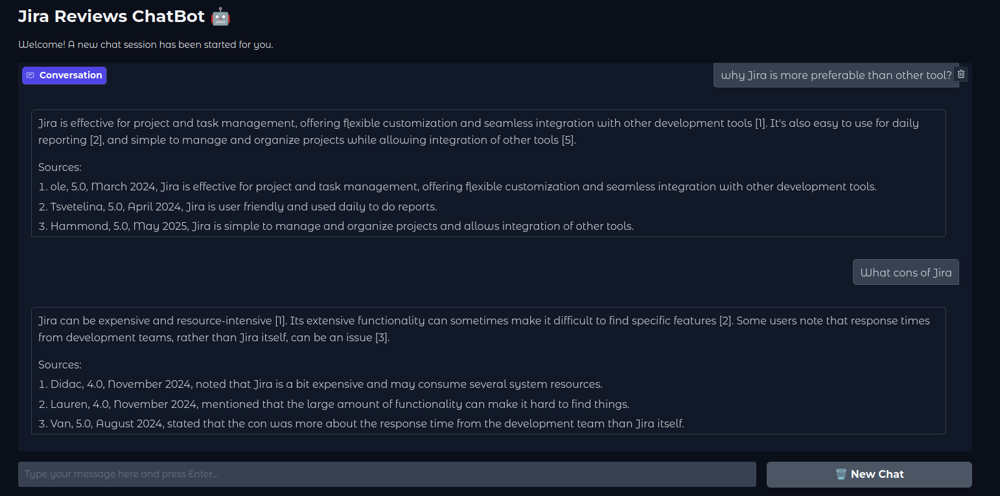
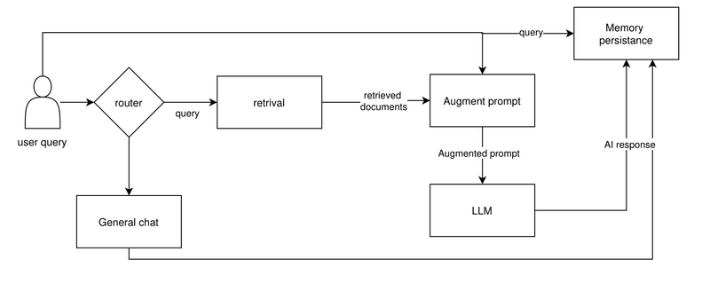

# 🚀 Jira Review RAGBot

An intelligent chatbot that answers questions using a **Jira reviews knowledge base**.
Built using **Retrieval-Augmented Generation (RAG)** and **LangChain**, it fetches relevant context from documents and generates accurate answers using a Large Language Model (LLM).

<p align="center">
  
</p>

---

## 📦 Project Architecture

<p align="center">
  
</p>

---

## 🛠️ Getting Started

Follow these steps to set up and run the project locally.

### 1. Clone the Repository

```bash
git clone https://github.com/muhammad-faizan-122/jira-review-ragbot.git
cd jira-review-ragbot
```

### 2. Create a Virtual Environment

```bash
python3 -m venv venv
source venv/bin/activate  # On Windows: venv\Scripts\activate
```

### 3. Install Dependencies

```bash
pip install -r requirements.txt
```

### 4. Ingest the Knowledge Base

This will process your Jira review documents into a vector database.

```bash
python3 ingest.py
```

### 5. Run the Application

Launch the chatbot UI using Gradio.

```bash
python3 app.py
```

---

## 💬 How It Works

* **User inputs a query** about Jira reviews.
* The system retrieves relevant documents using **BM25** and **Chroma (Dense Vector Search)**.
* An **LLM (like Gemini or GPT)** generates an answer using both the user query and document context.

---

## 🧠 Tech Stack

* 🧩 LangChain & LangGraph
* 📚 Chroma Vector Store & BM25
* 🤖 HuggingFace Embeddings
* 🌐 Gradio (Web UI)
* 🧪 Pydantic + Logging + .env Config

---