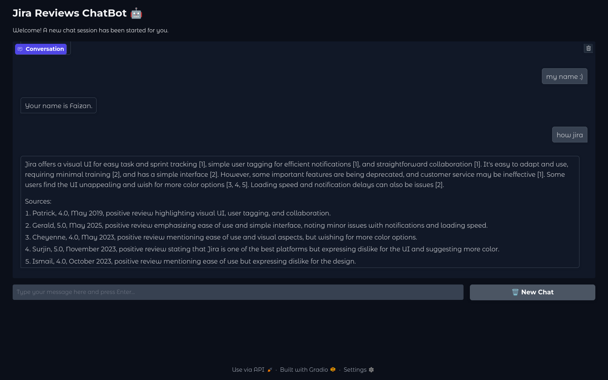

# Jira Review RAGBot
The goal is to build a chatbot that answers user questions in the context of a Jira reviews knowledge base. When a user asks a question about Jira, the AI bot retrieves relevant documents from the knowledge base and passes them to an LLM (Large Language Model) to generate an answer based on the retrieved documents.



## Block Diagram

## usage
1. Clone repo
```
git clone https://github.com/muhammad-faizan-122/jira-review-ragbot.git
```
2. Create virtual env

3. Install requirements using 
```
pip install -r requirements.txt
```
4. Run ingestion script
```
python3 ingest.py
```
5. Run the app
```
gradio app.py
```
